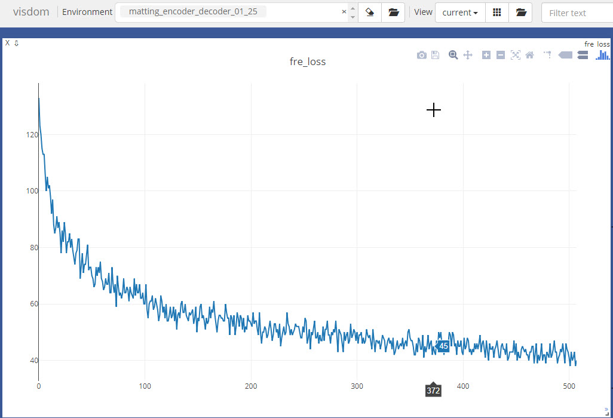

#### This is an implementation for paper [Deep Image Matting](http://arxiv.org/abs/1703.03872)  
- Deep image matting is a learning method to estimate the alpha matting params for fg,bg,merged and trimap   
- 该项目基于pytorch实现，主要的数据，模型，损失函数，训练策略介绍如下：    
-- [data/py_adobe_data.py](https://github.com/hudengjunai/DeepImageMatting/blob/master/data/py_adobe_data.py) .the online fg/bg alpha merge data,compose COCO 2014 train and Matting Datasets   
-- [models/py_encoder_decoder.py](https://github.com/hudengjunai/DeepImageMatting/blob/master/models/py_encoder_decoder.py). The model define ,vgg encoder and unpooling/conv decoder.   
-- [train_encoder_decoder.py](https://github.com/hudengjunai/DeepImageMatting/blob/master/train_encoder_decoder.py). The train stage define, encoder-decoder/refine-head/over-all,totally three stages.  
-- [utils/visulization.py](https://github.com/hudengjunai/DeepImageMatting/blob/master/utils/visulization.py). The loss and image vis module


#### 项目简介
-- 数据集，数据集使用在线合成的方法。具体存放路径如下所示：  
```buildoutcfg
            self.a_path = './data/adobe_data/trainval/alpha' #alpha 存放路径，将Train数据的alpha和Others数据的alpha收集一起存放这里
            self.fg_path = './data/adobe_data/trainval/fg/' #同上， 存储前景数据，共439张
            self.bg_path = '/data/jh/notebooks/hehao/datasets/coco/train2014/' #the coco path 指向coco数据集地址
            
```
### 单模块测试  
##### 数据模块 
数据模块的功能性测试，可单独测试
```bash
DeepImageMatting$ python data/py_adobe_data.py
```
```angularjs
        data[:,:,0:3] = image # firset three rgb channel ,经过归一化的数据sub-mean,div-std
        data[:,:,3] = torch.tensor(trimap)  # last channel is trimap,value(0,128,255) 255为前景

        label[:,:,0:3] = torch.tensor(bg)   #前景，（0，255）之间取值
        label[:,:,3:6] = torch.tensor(fg)   #背景，（0，255）之间
        label[:,:,6:9] = torch.tensor(merged) #合成图（0，255），该值和data[0:3]一样，只不过没经过归一化，为便于计算loss缘故
        label[:,:,9:10] = torch.tensor(alpha.reshape(self.size,self.size,1)) #ground_truth alpha matting值
        label[:,:,10] = torch.tensor(mask) #unknown region区域的掩码
        
```
##### 模型模块  
模型部分包括encoder-decoder，encoder-decoder-refinehead 残差结构，都可以使用以下语句测试
```bash
DeepImageMatting$ python models/py_encoder_decoder.py #测试模型计算
论文种对于Unpooling 和Deconv介绍不是很清晰，针对SegNet网络种的介绍，可以在vgg maxpooling时保留Max的位置索引，在上采样时进行赋值。  
上采样有若干种方法：双线性插值（可学习），双线性插值（不可学习），转置卷积（反卷积，stride大于1），reverse maxpooling等方式，当前实现种采用反向maxpooling的方式

```
##### 模型与训练参数加载  
matting网络的encoder部分采用的vgg_bn16的参数，需要将对应参数灌入当前模型，具体参见models/py_encoder_decoder.py 中load_vggbn 函数  

##### 损失函数  
损失函数分为两种，参考论文中提出的alpha-prediction loss 和 Compositional loss 计算方式可参见内部loss类型
```bash
DeepImageMatting$ python models/py_loss.py #测试损失函数
对于论文中提出的损失函数有两个：  
- alpha 损失，预测的matting参数和groud_truth alpha之间的差值平方均值 mse。 具体参见 AlphaPredLoss  
- compose损失，使用matting预测参数合成的图片和原本真实合成图片的mse差值 。具体参见 ComposeLoss
```

##### 训练模块  
所有的三个阶段的训练模块都集中在自定义类Trainer中，分为初始化：设置数据模型损失函数训练策略，训练，验证主要的模块
```bash
DeepImageMatting$ python train_encoder_decoder.py --params  
其中stage为阶段参数： 
- 第一阶段：训练encoder-decoder 类似于SegNet结构
- 第二阶段：训练refine_head,一个alpha细化模块 。
- 第三阶段：整体进行训练，整体结构类似一个残差块。
```

### 训练过程记录：  
#### Doing list
 - 在第一阶段encoder-decoder训练时，因为alpha prediction loss和compositional loss 的数量级不一样，采用文中作者提出的两种loss加起来，
 会导致无法收敛，一直震荡的状态，通过观察梯度发现梯度很小，根据论文中实验部分描述，采用alpha-prediction loss来train，会收敛。  
 
 
 - 需要尝试双线性插值和unpooling对训练的影响  
 [medium 博客,unpooling和deconv](https://towardsdatascience.com/review-deconvnet-unpooling-layer-semantic-segmentation-55cf8a6e380e)
 [unpooling介绍](https://jinzequn.github.io/2018/01/28/deconv-and-unpool/)
 ```python
unpooling deconv 的使用在SegNet等网络中
```
 - 需要训练encoder-decoder中间衔接的trans模块，卷积核大小，当前采用一个3x3和1x1(具体参见py_encoder_decoder.py的trans部分) 
 ```python
class transMap(nn.Module):
    def __init__(self):
        super(transMap,self).__init__()
        self.conv1 = conv2DBatchNormRelu(512,512,3,1,1)
        self.conv2 = conv2DBatchNormRelu(512,512,1,1,0)

    def forward(self, x):
        return self.conv2(self.conv1(x))
``` 
 - encoder的输入为合成图RGB和trimap通道，RGB通道按照之前totensor和normalize操作，
 trimap在当前数据集为（0，128，255）三个取值，其数值量级不一致，需要对trimap采用归一化的方法，当前采用 除以255，减去0.5均值，除以0.5的方式  
 -
